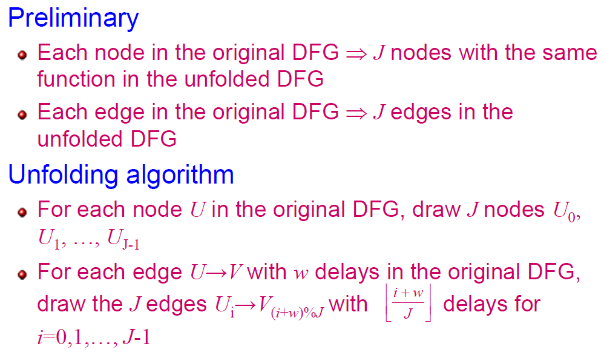

# Ch7 note

## unfolding

- A transformation technique
- Also known as loop unrolling
- Create a new program describing more than one iteration of the origin program

## Applications of unfolding 

- Unfold the program to reveal hidden concurrency so that the program can be scheduled to a smaller iteration period
- Design parallel architectures at the word level and bits level for high speed or low power purpose

  

