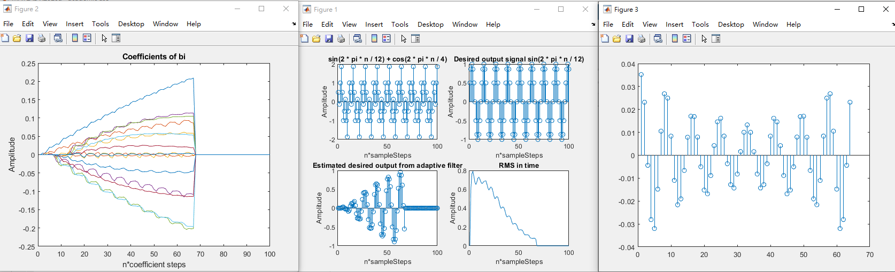
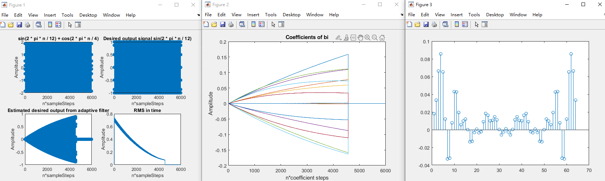
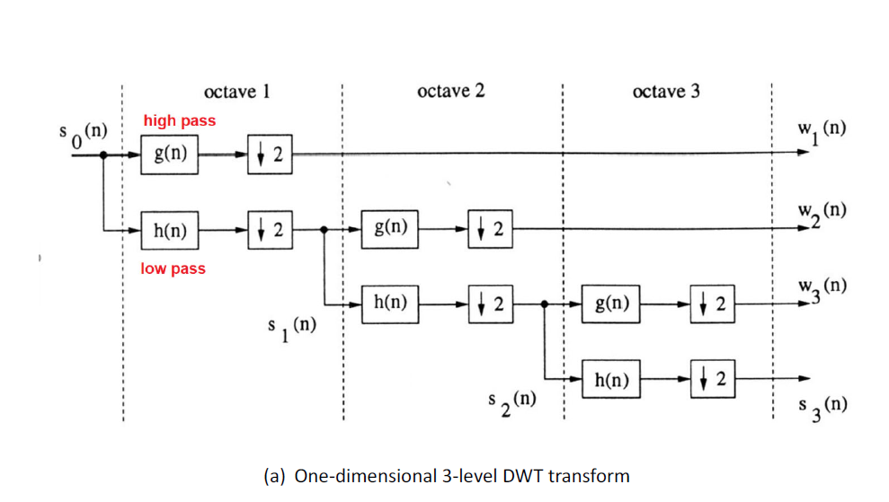
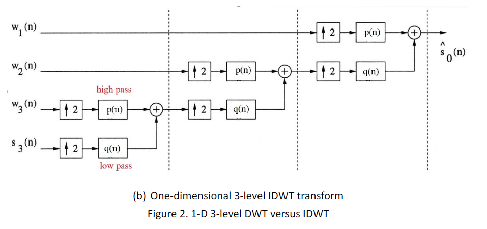
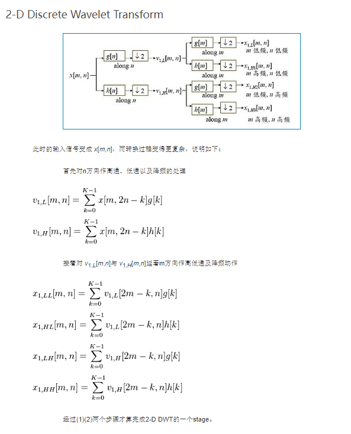
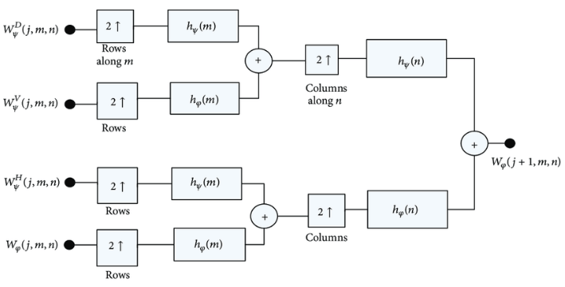
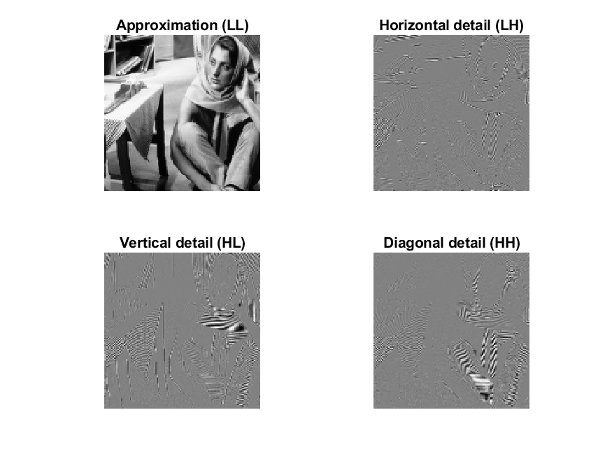
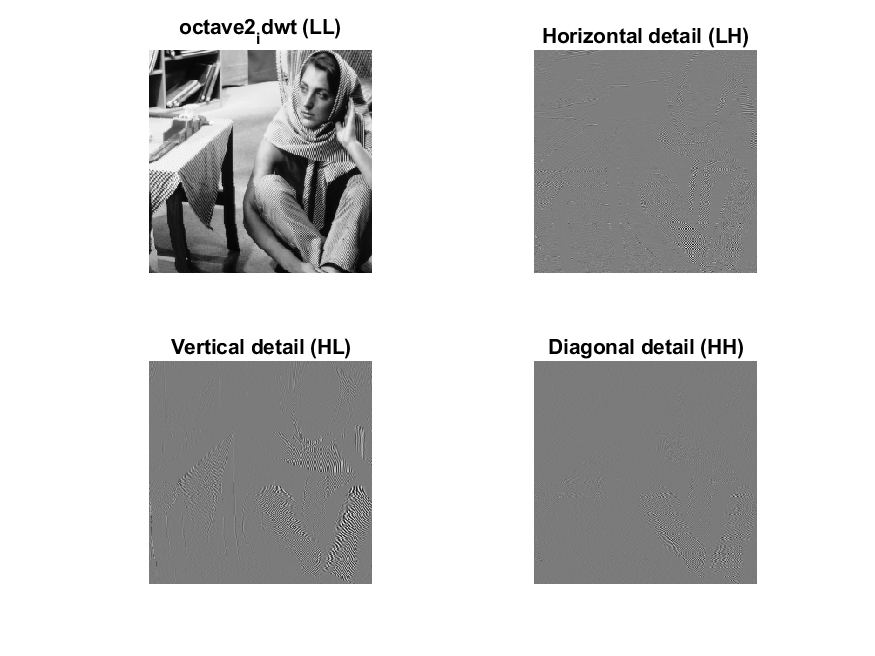
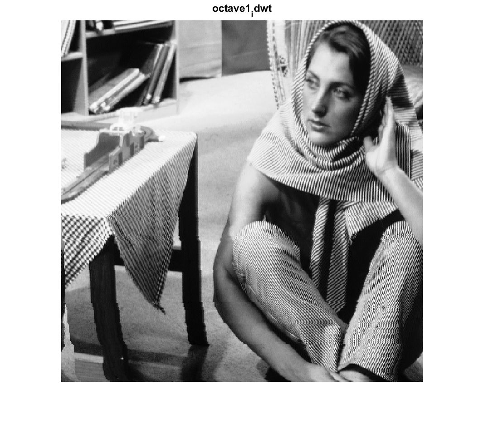

# <strong><font face = "Times New Roman"><p style="text-align: center;">HW2 LMS Filter and DWT Filter design</p></font></strong>
## <font face = "Times New Roman"><p style="text-align: center;">VLSI DSP HW2</p></font>
### <font face = "Times New Roman"><p style="text-align: center;">HSUAN-YU LIN, NCHU Lab716</p></font>


<font face = "Times New Roman">

# INDEX
- [Adaptive FIR Low pass filter](#i-adaptive-fir-low-pass-filter)
  - [Q1 Result](#q1-result)
- [2D-DWT](#ii-2d-dwt)
- [References](#iii-references)


# I. Adaptive FIR Low pass filter
## Problem
<p align="center">
  
</p>

<div style="page-break-after: always;"></div>

# Derivation steps
### Adaptive Filter specification
<p align="center">
  
</p>


1. x(n) is the input signal, wn(z) is the adaptive filter block with coefficients of wn.
2. d_hat(n) is the generated system response and d(n) is the desired signal.
3. e(n) is the error between d_hat(n) and d(n)
4. The adaptive algorithm block determines which kind of policy we should use to find the suitable filter coefficients. In this HW, LMS algorithm is chosen.

### The adaptive FIR filter
<p align="center">
  
</p>

<p align="center">
  
</p>

- The desired output is genereated through the p-tap FIR filter design, where wn is the coefficients that gets updated on the fly.

<div style="page-break-after: always;"></div>

### Error function
<p align="center">
  
</p>

- Error function simply is the difference between the desired signal and the generated system response.

- Ultimate goal is to minimize the autocorrelation between error vector and input signal.


### LMS algorithm
<p align="center">
  
</p>

- mu is the step sizes for the algorithm, which governs the variability of the coefficients in each iteration.
- e(n)X*(n) is the factor of auto-correlation between the input signal and the error function.

### RMS(Root mean square)
<p align="center">
  
</p>

- Root mean square used to find the norm of the error vector, we hope that this value be as small as possible s.t. the system is converged.

<div style="page-break-after: always;"></div>

## Q1 Result
<p align="center">
  
</p>

```
Sample_size = 100
mu = 0.01
Total Steps needed to reach 10% of RMS 67
RMS value 0.0673
```

<p align="center">
  
</p>

```
Sample_size = 6000
mu = 0.0001
Total Steps needed to reach 10% of RMS 4570
RMS value 0.0707
```

# II. 2D-DWT

## Problem

<p align="center">
  
</p>

<p align="center">
  
</p>

<p align="center">
  
</p>

<p align="center">
  
</p>

<p align="center">
  
</p>

### symmetric_extension

<p align="center">
  
</p>


### 1D 3‐level_DWT

<p align="center">
  
</p>

### 1D 3‐level_IDWT

<p align="center">
  
</p>

### 2D-DWT

<p align="center">
  
</p>

### 2D-IDWT

<p align="center">
  
</p>

### wavelet

<p align="center">
  
</p>

<p align="center">
  
</p>

## Q2 Result

### octave1_dwt

<p align="center">
  
</p>

### octave2_dwt

<p align="center">
  
</p>

### octave3_dwt

<p align="center">
  
</p>

### octave3_idwt

<p align="center">
  
</p>

### octave2_idwt

<p align="center">
  
</p>

### octave1_idwt

<p align="center">
  
</p>

### psnr

<p align="center">
  
</p>

```
psnr = 234.2033
```

# III. References

[1] [Advanced Digital Signal Processing, Adaptive Filters by Prof.Vaibhav Pandit](https://www.youtube.com/watch?v=088g4IB9blI)

[2] [Advanced Digital Signal Processing, LMS Algorithm by Prof.Vaibhav Pandit](https://www.youtube.com/watch?v=kXJ_WQlweiI&list=PLm_MSClsnwm8tzpHKvWlCdEeBba9yVsa_&index=139&t=369s)

[3] [MIT RES.6-008 Digital Signal Processing,Lec 17, 1975 by Alan Oppenheim](https://www.youtube.com/watch?v=oJv4dsUID0Q&t=841s)

[4] [EE123 Digital Signal Processing, SP'16 L12 - Discrete Wavelet Transform](https://www.youtube.com/watch?v=i0rPaAXjJoI&t=2730s)

[5] [Easy Introduction to Wavelets, by Simon Xu](https://www.youtube.com/watch?v=ZnmvUCtUAEE)

[6] [VLSI Digital Signal processing systems Design and Implementation, p25~28 by Parhi]()

[7] [Image Denoising Based on Improved Wavelet Threshold Function for Wireless Camera Networks and Transmissions,Sep 2015, Reserach Gate,Xiaoyu Wang Xiaoxu Ou Bo-Wei Chen Mucheol Kim](https://www.researchgate.net/figure/The-inverse-discrete-wavelet-transform-Here-h-i-i14-i-i-h-i-i14-i-i-h-i_fig7_283882847)

[8] [离散小波变换(Discrete Wavelet Transform)](https://blog.csdn.net/sunshihua12829/article/details/50285375)

.
