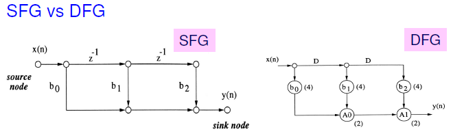

# Ch4 note

## DG Design in PDF(P9~P16)
- Write the recursive form of an algorithm
- Transform it into a Single Assignment Code
- Draw DG
- Localized DG
- [link](http://media.ee.ntu.edu.tw/courses/dspdesign/16F/slide/7_systolic_architecture_design.pdf)

## P4-1~

1. A directed graph

- Primarily used in systolic array design

- show all the computations performed in the algorithm and the data dependence of these computation

- Node: one computation instance

- Directed edge: precedence constraint

- DG can be derived from algorithms

  - described as a nested loop
  - Each node corresponds to computations of the loop body
  - Each variable is assigned once
  - Single assignment code
  - As one computing instance

2. example 

```
for i = 1~4
  c[i]=0;
  for j = 1~4
    c[i]+=a[i,j]*b[j];
```

- define a coordinate system subject to loop indexes
- place each node in a Cartesian system subject to the index, and each node should have two indices
- b is broadcasting signal

<p align="middle">
  
</p>

- After DG localization

<p align="middle">
  
</p>

<p align="middle">
  
</p>

3. DG v.s DFG(data flow graph)

- DFG node: represents computation in one iteration and executed repetitively from one iteration to another
- DG node: represents a single computation instance
- DFG contains computations in one iteration
- DG contains computations for all iterations in an  algorithm
- DFG edge: may contain a delay, one delay means one iteration apart
- DG edge: contains no delay

- DFGs can be derived from DG
  - By using a space-time transform mapping scheme
  - Different DFGs can be derived from a DG
  - Different DFGs (corresponding to the same DSP algorithm) may have
  - different hardware implications

4. SFG(Signal Flow Graph)

- Node: computation or task
- Directed edge (j,k)
  - a linear transformation from node j to node k
  - Usually as constant gain multiplier or delay elements
- Widely used in digital filter structures
- Representing computations in one iteration
- An alternative algorithm representation of DFG

<p align="middle">
  
</p>

- Flow graph reversal (transposition)
  - A transform to obtain equivalent structure
  - Applicable to single-input single output system
  - Reverse the directions of all edges
  - Exchange the input output node
  - Retain the edge gain and edge delay
- Limitations of transposition
  - can be applied to MIMO systems described by    symmetric transform matrices
- More on SFG
  - Applicable to linear network
  - Cannot be used to described multi-rate system

<p align="middle">
  
</p>

## Ref

[1] [如何在 Markdown 輸入數學公式及符號
](https://blog.maxkit.com.tw/2020/02/markdown.html)

[2] [Markdown 文本居中、字体颜色以及数学公式
](https://blog.csdn.net/silver1225/article/details/89036250)

[3] [VLSI Signal processing](http://twins.ee.nctu.edu.tw/courses/vsp_04/handout/Lecture%205.pdf)

[4] [Digital Signal Processing VLSI Systems
](http://media.ee.ntu.edu.tw/courses/dspdesign/16F/slide/7_systolic_architecture_design.pdf)