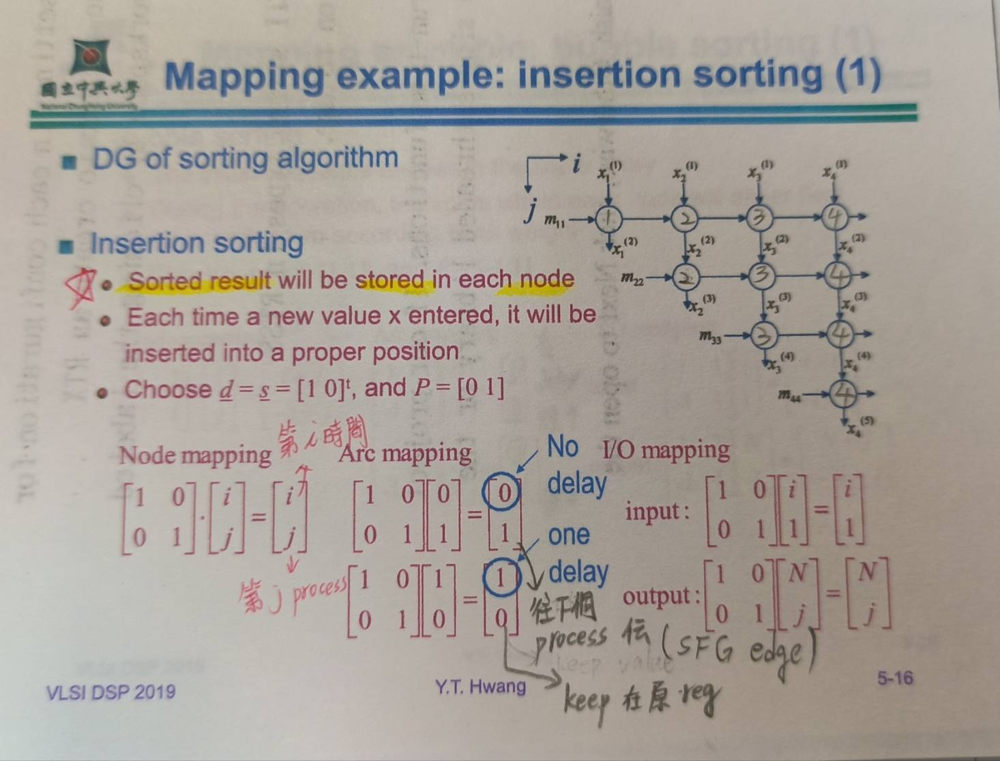

# Ch5 note

## p5-1~p5-12 note

1. 同個hyperplane為相同執行順序
2. 同個projection為同樣一顆processor
3. normal vector ($\vec{s}$) 垂直於hyperplane，length由DG維度決定
4. components of the scheduling vector $\vec{s}$ must be co-prime(互質)
5. schedule of node i = inner product of $\vec{s}$ & i
6. nodes on the same hyperplane should not be assigned to the same processor to preserve computing parallelism
- Observe partial ordering(precedence relation)  
$\vec{s^t} \cdot \vec{e} \geq 0$ for all $\vec{e}$ (單位向量)
- Preserve parallelism  
$\vec{s^t} \cdot \vec{d} \neq 0$ for projection vector $\vec{d}$
7. Type of schedules  
- default schedule => $\vec{s} = \vec{d}$ 
- Resursion schdule => $\vec{s}$ is parallel to one of axis in the index space of the DG, usually the recursion direction
- Systolic schedule => at least one delay on each edge of SFG
8. example 在講義5-9~5-11
- pipeline period $\alpha = \vec{s^t} \cdot \vec{d}$ (number of clock cycles between two successive computations)

## P5-13~

1. $\vec{P}$ is the processor basis or processor allocation matrix, and their dim is (N-1) * N(N is DG dimension)
- spatial mapping
- $P\cdot \vec{e} = 0$ , where $\vec{d}$ is projection vector
- process index $\vec{n}$ = $ P \cdot \vec{i}$

2. Timing mapping
- time index t = $\vec{s^t} \cdot \vec{i}$, $\vec{s^t}$ is the scheduling vector

3. Transfer matrix is

$$
\begin{bmatrix}
1 & 2 & 3 \\
4 & 5 & 6 \\
7 & 8 & 9
\end{bmatrix}
\tag{3-4}
$$

$$
T=
\begin{bmatrix}
{\vec{s^t}}\\
P\\
\end{bmatrix}
$$

4. Mapping procedures
- Node mapping
$$
        \begin{bmatrix}
        \vec{t(\vec{i})} \\
        \vec{n}
        \end{bmatrix}
        =
        \begin{bmatrix}
        \vec{s^t} \\
        P
        \end{bmatrix}
        \cdot
        \begin{bmatrix}
        \vec{i} 
        \end{bmatrix}
$$ 
$\vec{i}$ is DG node, $t(\vec{i})$ is schedule, $\vec{n}$ is Processor index

- Arc mapping
$$
        \begin{bmatrix}
        \vec{D(\vec{e})} \\
        \vec{e}
        \end{bmatrix}
        =
        \begin{bmatrix}
        \vec{s^t} \\
        P
        \end{bmatrix}
        \cdot
        \begin{bmatrix}
        \vec{a} 
        \end{bmatrix}
$$
$\vec{a}$ is DG arc, $D(\vec{e})$ is edge delay, $\vec{e}$ is SFG edge

- IO mapping
$$
        \begin{bmatrix}
        \vec{t(\vec{c})} \\
        \vec{n}
        \end{bmatrix}
        =
        \begin{bmatrix}
        \vec{s^t} \\
        P
        \end{bmatrix}
        \cdot
        \begin{bmatrix}
        \vec{c} 
        \end{bmatrix}
$$
$\vec{c}$ is I/O node, $t(\vec{c})$ is schedule, $\vec{n}$ is Processor index

  

## Ref

[1] [如何在 Markdown 輸入數學公式及符號
](https://blog.maxkit.com.tw/2020/02/markdown.html)